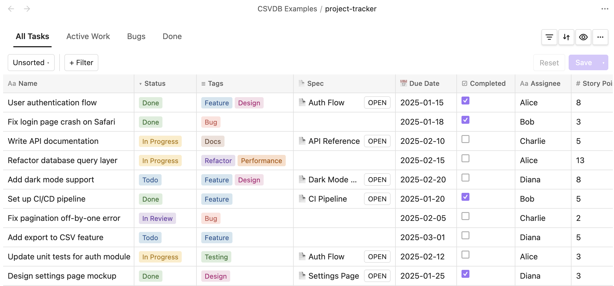
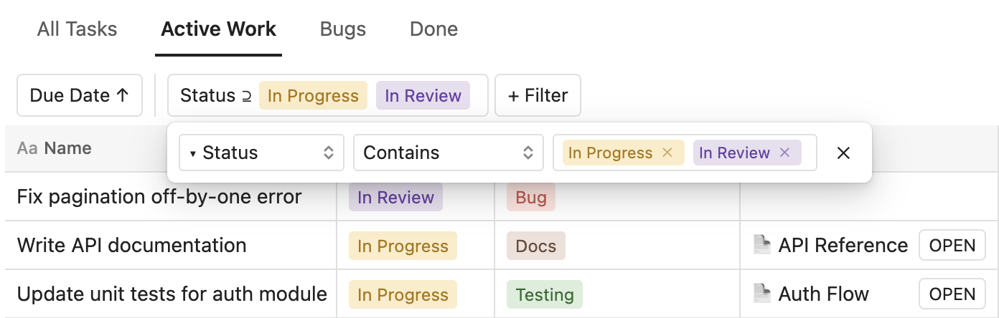
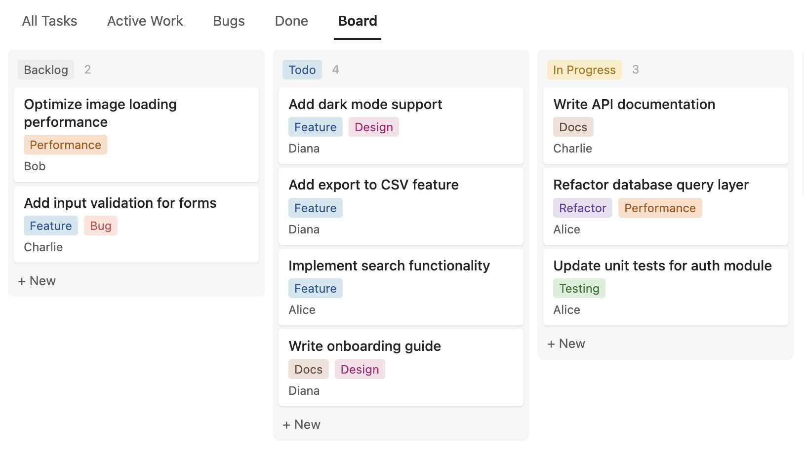

# Rowbase

Rowbase is an [Obsidian](https://obsidian.md) plugin that provides an interactive database view backed by `.csvdb` files — each database is a single `.csvdb` file that stores its rows and column metadata in a human-readable CSV format. It supports multiple column types, inline editing, and more.

Rowbase is an engineering fork of [jysperm/obsidian-csv-database](https://github.com/jysperm/obsidian-csv-database). The `.csvdb` extension is registered natively and opens in a dedicated Obsidian view, so databases are never embedded as SQL code blocks in your notes.

<p align="center">
  <br />
  <span>Database view with multiple column types</span>
</p>

<p align="center">
  <br />
  <span>Multiple views with sort and filter</span>
</p>

<p align="center">
  <br />
  <span>Inline editing with multi-select dropdown</span>
</p>

<p align="center">
  <br />
  <span>Board layout with drag-and-drop</span>
</p>

## Features

- **Rich column types**: text, number, date, checkbox, select, multi-select, note, title, and relation
- **Inline editing**: click any cell to edit its value directly
- **Manual row ordering**: drag rows to adjust their order
- **Column management**: rename, change type, configure options, resize, reorder, and delete columns
- **Wrap content**: per-column toggle to wrap cell content to multiple lines
- **Select & multi-select**: color-coded tags with a dropdown picker
- **Title & relation**: give each row a unique title and reference rows from other databases
- **Multiple views**: create named views, each with its own sort, filter, and column visibility settings
- **Board layout**: kanban-style board view grouped by a select column, with drag-and-drop between columns
- **Sort & filter**: sort by multiple columns, filter with contains / does not contain / is empty / is not empty operators
- **Auto-save**: all changes are saved back to the CSV file immediately

## Installation

Rowbase is not yet in the Obsidian community plugin directory. Install it via [BRAT](https://github.com/TfTHacker/obsidian42-brat):

1. Install the **BRAT** plugin from **Settings** → **Community Plugins** → **Browse**
2. Open BRAT settings, click **Add Beta Plugin**
3. Enter the repository URL for the Rowbase fork and click **Add Plugin**
4. Enable **Rowbase** in **Settings** → **Community Plugins**

## Usage

1. Use the command palette (`Ctrl/Cmd + P`) and run **Create new database** to create a `.csvdb` file
2. Add columns using the **+** button in the header row
3. Add rows using the **+ New** button at the bottom

The `.csvdb` file is a standard CSV file with column metadata encoded in the header row. It remains human-readable and can be opened with any text editor or spreadsheet application.

## Development

```bash
npm ci
npm run dev    # watch mode
npm run build  # production build
```

To test locally, create a symlink from your vault's plugin directory to the project root:

```bash
ln -s /path/to/rowbase /path/to/vault/.obsidian/plugins/rowbase
```

## Offline baseline

Rowbase's runtime is fully offline. It makes no HTTP requests, WebSocket
connections, telemetry, CDN asset fetches, or remote service calls; everything
reads from and writes to the local Obsidian vault. Its runtime source and the
production bundle are audited against that policy by:

```bash
npm run build            # produces main.js
npm run test:offline     # scans src/ and main.js for network/dynamic-code behavior
```

The audit (`test-offline-baseline.mjs`) rejects `fetch`, `XMLHttpRequest`,
`WebSocket`, `http(s)://`, `127.0.0.1`, `localhost`, `eval`, and
`new Function(` in Rowbase's runtime source and in the built bundle. It ignores
fork documentation (`UPSTREAM.md`), README installation links, package-lock
metadata, and comments that document the audit itself. Inert string constants
and dead code paths carried inside the preserved bundled dependencies (for
example React DOM's XML namespace identifiers and papaparse's unused remote
download path) are permitted and documented in the test, since bundled
dependencies are not removed.

## License

The majority of this code was written by Claude Code (Opus), but all code has been thoroughly reviewed and tested by a human. The upstream project is by jysperm and is licensed under the MIT License; that license and attribution are preserved in [LICENSE](LICENSE). Rowbase is itself released under the [MIT License](LICENSE).
