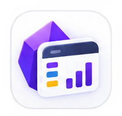

# Rowbase

Rowbase is an [Obsidian](https://obsidian.md) plugin that brings Notion-style databases to your vault. Each database is a single `.rbase` file — a human-readable CSV with JSON column metadata — that opens in a rich, interactive view with multiple layouts, formulas, relations, and more.

Rowbase is an engineering fork of [jysperm/obsidian-csv-database](https://github.com/jysperm/obsidian-csv-database). The `.rbase` extension is registered natively and opens in a dedicated Obsidian view.

<p align="center">
  
</p>

## Features

### Views
- **Table** — Full-featured spreadsheet with inline editing, sorting, filtering, column resizing, and row reordering
- **Kanban** — Drag-and-drop board grouped by a select column
- **List** — Compact grouped rows with collapsible sections
- **Gallery** — Card grid with cover images and clickable detail modals
- **Chart** — Bar, Line, Pie, and Area charts with aggregation and color-by options
- **Stats** — Summary cards, numeric stats, select color distribution, and date distribution
- **Timeline** — Gantt-style timeline with status colors, grid lines, today marker, zoom, and tooltips
- **Dashboard** — Habit tracking with streaks, completion rings, and activity calendar heatmap

### Column Types
- Text, Number, Date, Checkbox, Select, Multi-select, Title, Note, Relation, Rollup, Formula

### Data & Computation
- **Formulas** — Safe expression evaluator with cell references and cross-relation aggregation (SUM, AVG, COUNT, MIN, MAX)
- **Rollups** — Aggregate related rows (sum, count, avg, min, max) across relation columns
- **Relations** — Link rows across databases; preloaded resolver with cache for fast cross-file lookups
- **Sorting** — Multi-column sort with ascending/descending toggle
- **Filtering** — Text (contains, starts with, is empty), Number (>, <, between), Date (before, after, between), Select (is, is not), Checkbox filters
- **Grouping** — Group rows by any column with collapsible sections

### UI/UX
- **Inline editing** — Click any cell to edit; text, number, date, and select types all editable in place
- **Undo/Redo** — Cmd+Z / Cmd+Shift+Z with 100-step history stack
- **Column management** — Add, rename, resize (double-click to auto-fit), reorder, delete columns via context menu
- **Title linking** — Open or create notes from title cells; configure note folder per column
- **Folder linking** — Create folders directly from title cells; configure default folder per column
- **Multi-select keyboard nav** — Arrow keys, Enter to select, Escape to close
- **Empty states** — Friendly placeholder with icons when databases or views are empty
- **Mobile responsive** — Optimized for tablets and phones with touch-friendly targets
- **Import/Export** — Import CSV files into databases; export to CSV or JSON
- **Plugin settings** — Default folder, template name, template columns, note/folder linking defaults

## Installation

### Community Plugin (recommended)
1. Open **Settings** → **Community Plugins** → **Browse**
2. Search for **Rowbase** and install it
3. Enable **Rowbase** in **Settings** → **Community Plugins**

### Manual installation
1. Download `main.js`, `manifest.json`, and `styles.css` from the [latest release](https://github.com/Soulaymane01/rowbase/releases)
2. Create a folder `rowbase` in your vault's `.obsidian/plugins/` directory
3. Copy the three files into that folder
4. Enable **Rowbase** in **Settings** → **Community Plugins**

## Usage

1. Use the command palette (`Ctrl/Cmd + P`) and run **Create new database** to create a `.rbase` file
2. Add columns using the **+** button in the header row
3. Add rows using the **+ New** button at the bottom
4. Switch views using the view selector in the toolbar
5. Sort, filter, and group rows using the toolbar controls

The `.rbase` file is a standard CSV file with column metadata encoded in the header row. It remains human-readable and can be opened with any text editor or spreadsheet application.

## Development

```bash
npm ci
npm run dev    # watch mode
npm run build  # production build
```

To test locally, create a symlink from your vault's plugin directory to the project root:

```bash
ln -s /path/to/rowbase /path/to/vault/.obsidian/plugins/rowbase
```

## Offline baseline

Rowbase's runtime is fully offline. It makes no HTTP requests, WebSocket
connections, telemetry, CDN asset fetches, or remote service calls; everything
reads from and writes to the local Obsidian vault. Its runtime source and the
production bundle are audited against that policy by:

```bash
npm run build            # produces main.js
npm run test:offline     # scans src/ and main.js for network/dynamic-code behavior
```

## License

The upstream project is by jysperm and is licensed under the MIT License; that license and attribution are preserved in [LICENSE](LICENSE). Rowbase is itself released under the [MIT License](LICENSE).
